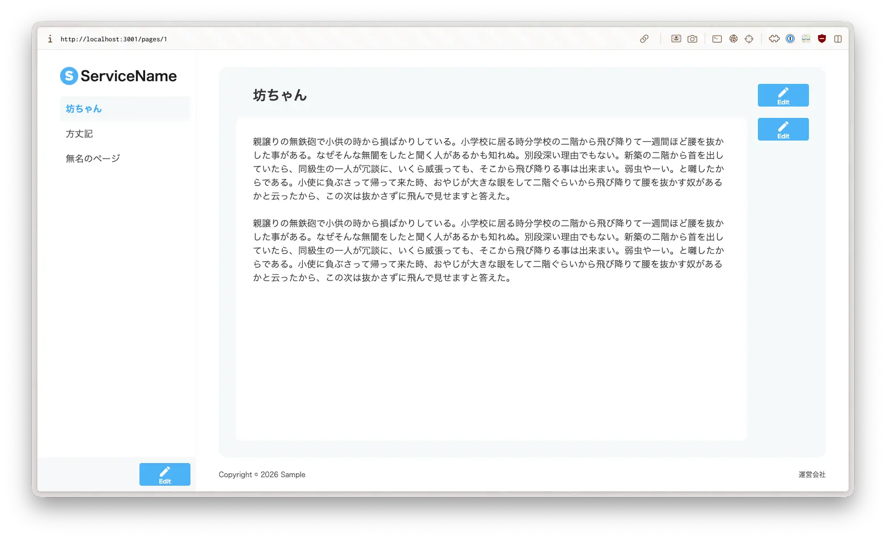

## Description

ページを作成、編集、削除できるアプリのフロントエンドです。



## Development

### 準備

実行にはmiseが必要です。

```shell
mise install
```

```shell
pnpm i
```

```shell
cp .env.example .env
```

### 起動

```shell
pnpm dev
```

起動したら、ブラウザで[http://localhost:3001](http://localhost:3001)を開いてください。バックエンドがポート3000を使うので、フロントエンドは3001で動かしています。

`.env` の `NEXT_PUBLIC_API_MOCKING` が `disabled` のときは本物のバックエンドへリクエストを送るので、先にバックエンドを起動しておいてください。一方で `enabled` にすると、MSWのモックがAPIの代わりに応答します。そのため、バックエンドがなくても動かせます。

### テストとLint

```shell
# モデルとContainerのテスト、Storybookのストーリーのテストをまとめて実行する
pnpm test

# Storybookを起動する
pnpm storybook

# Lint、フォーマット、マークアップ、CSSのルールに沿っているか確かめる
pnpm check
```

### OpenAPIの定義

APIクライアントとモックは、`openapi/openapi.json` から生成しています。ただし、この定義はバックエンドから取得したものに手を加えています。具体的にはIDを1以上の整数にし、タイトルと本文に文字数の制約を加えました。さらに、タイトルはnullを許さず、作成と更新のリクエストではタイトルと本文を省略できるようにしています。したがって、`pnpm openapi:fetch` で定義を取得し直すと、これらの変更は失われます。

## Design philosophy

### Next.jsを選んだ理由

フレームワークにはNext.jsのApp Routerを使っています。Next.jsを選んだ理由は、特別な工夫をしなくてもユーザー体験の面で高いパフォーマンスを出せるためです。具体的にはデータの取得をServer Componentsで行い、結果を `'use cache'` でキャッシュしています。そして、ページを編集したときは `updateTag` でキャッシュを無効にし、最新のデータを取得し直します。

### Async Reactに沿った作り

非同期処理の待ち時間は、Suspenseとトランジションで扱っています。たとえばサイドバーでは、ページ一覧の取得をサーバーで始め、Promiseのままクライアントへ渡す形にしました。そのうえで一覧の部分だけが `use` で完了を待つので、ロゴとフッターは先に表示されます。また、読み込み中は一覧の代わりにスケルトンを出し、Editボタンも押せない状態にしています。同様に、ページの編集画面も、読み込みが終わるまでは同じ形のスケルトンを表示する作りになっています。

一方、保存や削除のようなServer Actionの呼び出しは、トランジションの中で行います。そのため、処理中はボタンがスピナーに変わり、同じ操作を重ねて送れないようにしています。

### hey-apiによるAPIクライアントの自動生成

バックエンドとの通信には、OpenAPIの定義からhey-apiで自動生成したクライアントを使っています。さらに、型とSDKに加えて、fakerでデータを作るMSWのモックも同じ定義から生成します。したがって、APIの定義が変わっても、生成し直せばクライアントとモックの両方が追従します。また、開発中は `NEXT_PUBLIC_API_MOCKING` を切り替えて、モックとバックエンドを使い分けられます。

### 機能ごとのディレクトリ構成

ソースコードは、ドメインの概念ごとに `src/features` の下へまとめています。

```
src/
├── app/            # ルーティング
├── components/     # ドメインに依存しないUI部品（ボタン、アイコン）
├── features/
│   ├── page/       # ページ
│   ├── page-title/ # ページのタイトル
│   ├── page-body/  # ページの本文
│   └── site/       # サイト全体のUI（サイドバー、フッター）
└── lib/            # APIクライアントなどの基盤
```

さらに、各featureの中は、`models` や `actions`、`fetchers`、`components` のように役割で分けています。そのため、機能が増えたときはfeatureを足していけばよく、変更の影響を1つのfeatureの中へ収めやすい構成にしています。

### 方針と詳細の分離

ドメインのルールを方針、APIの呼び出しや画面の描画を詳細として扱い、両者を分けています。そのうえで、テストでは方針の側を重点的に確かめます。

まず、ドメインのルールは `models` の中で定義しています。たとえば、タイトルは1文字以上50文字以下で本文は10文字以上2000文字以下という制約を、valibotのスキーマで表しました。そして、検証の結果は例外ではなく、byethrowの `Result` で返します。なお、エラーの型は、error-factoryで定義した専用のクラスになっています。また、ページについては、本文が未入力の状態と入力済みの状態をDiscriminated Unionで表しました。そのため、状態で分岐しないと本文を取り出せず、未入力の扱いを書き忘れると型エラーになります。

これらのルールには、fast-checkによるプロパティベーステストを書いています。なお、テストはvitestのin-source testとして、モデルと同じファイルに置きました。

次に、コンポーネントは、Container/Presentationalパターンで分けています。Containerはデータの取得だけを担い、関数として呼び出して、表示側に渡す値をテストします。一方、表示だけを担うコンポーネントの確認には、Storybookのストーリーを使いました。このように、ドメインのロジックをコンポーネントから切り離したので、ルールのテストに画面の描画を持ち込まずに済んでいます。
